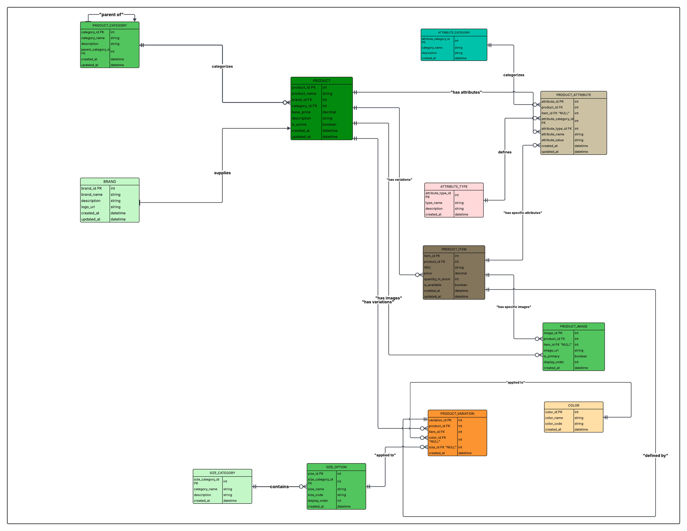

# E-Commerce Database Design Project

## Project Overview
This project demonstrates a comprehensive database design for an e-commerce platform using MySQL. The system is designed to efficiently manage products, variations, categories, attributes, and images - essential components of any modern e-commerce system.

## Table of Contents
- [Entity Relationship Diagram](#entity-relationship-diagram)
- [Database Structure](#database-structure)
- [Key Features](#key-features)
- [Setup Instructions](#setup-instructions)
- [Sample Queries](#sample-queries)
- [Group Number](#group-number)

## Entity Relationship Diagram
The database design follows a well-structured entity-relationship model that captures the complex relationships between products and their variations.



## Database Structure

### Core Tables
| Table Name         | Description                                                |
|--------------------|------------------------------------------------------------|
| `brand`            | Stores brand information for products                      |
| `product_category` | Hierarchical category structure for product classification |
| `product`          | Base product information                                   |
| `product_item`     | Specific purchasable product variations (SKUs)             |
| `product_image`    | Product and item-specific images                           |

### Variation Management
| Table Name      | Description                                         |
|-----------------|-----------------------------------------------------|
| `color`         | Available color options                             |
| `size_category` | Categories of sizes (clothing, shoes, etc.)         |
| `size_option`   | Specific sizes within categories                    |
| `product_variation` | Links specific variations to products and items |

### Attribute Management
| Table Name           | Description                                            |
|----------------------|--------------------------------------------------------|
| `attribute_category` | Groups attributes (physical, technical, etc.)          |
| `attribute_type`     | Defines data types for attributes (text, number, etc.) |
| `product_attribute`  | Stores specific attributes for products and items      |

## Key Features

### Flexible Product Structure
- Products can have multiple variations (SKUs)
- Variations can have different prices, inventory levels, and attributes
- Support for size and color options with extensible attribute system

### Hierarchical Categories
- Self-referencing category structure allows for unlimited category depth
- Products can be categorized at any level of the hierarchy

### Comprehensive Attribute System
- Custom attributes for both general products and specific items
- Different attribute types supported (text, number, boolean, date)
- Attributes categorized for easier management

### Image Management
- Multiple images per product
- Images can be linked to general products or specific items
- Support for image ordering and primary image designation

## Setup Instructions

### Prerequisites
- MySQL Server 5.7 or higher
- MySQL client or management tool (MySQL Workbench recommended)

### Database Creation
1. Connect to your MySQL server
2. Create a new database:
   ```sql
   CREATE DATABASE ecommercedb;
   USE ecommercedb;
   ```
3. Run the provided SQL script:
   ```
   mysql -u username -p ecommercedb < ecommerce.sql
   ```

## Sample Queries

### Get all products with their brand and category
```sql
SELECT product.product_id, product.product_name, brand.brand_name, product_category.category_name
FROM product
JOIN brand ON product.brand_id = brand.brand_id
JOIN product_category ON product.category_id = product_category.category_id;
```

### Get all variations of a specific product
```sql
SELECT product_item.SKU, product_item.price, color.color_name, size_option.size_name
FROM product_item
JOIN product_variation ON product_item.item_id = product_variation.item_id
LEFT JOIN color ON product_variation.color_id = color.color_id
LEFT JOIN size_option ON product_variation.size_id = size_option.size_id
WHERE product_item.product_id = 1;
```

### Get product attributes with their categories and types
```sql
SELECT product.product_name, product_attribute.attribute_name, product_attribute.attribute_value, 
       attribute_category.category_name, attribute_type.type_name
FROM product_attribute
JOIN product ON product_attribute.product_id = product.product_id
JOIN attribute_category ON product_attribute.attribute_category_id = attribute_category.attribute_category_id
JOIN attribute_type ON product_attribute.attribute_type_id = attribute_type.attribute_type_id;
```

### Get all products with their primary images
```sql
SELECT product.product_name, product_image.image_url
FROM product
LEFT JOIN product_image ON product.product_id = product_image.product_id
WHERE product_image.is_primary = 1 AND product_image.item_id IS NULL;
```

### Get inventory status of all product items
```sql
SELECT product.product_name, product_item.SKU, 
       product_item.quantity_in_stock, product_item.price, product_item.is_available
FROM product_item
JOIN product ON product_item.product_id = product.product_id
ORDER BY product.product_name;
```

## Group Number 
-Group 562

## License
This project is created for educational purposes as part of a database design assignment.